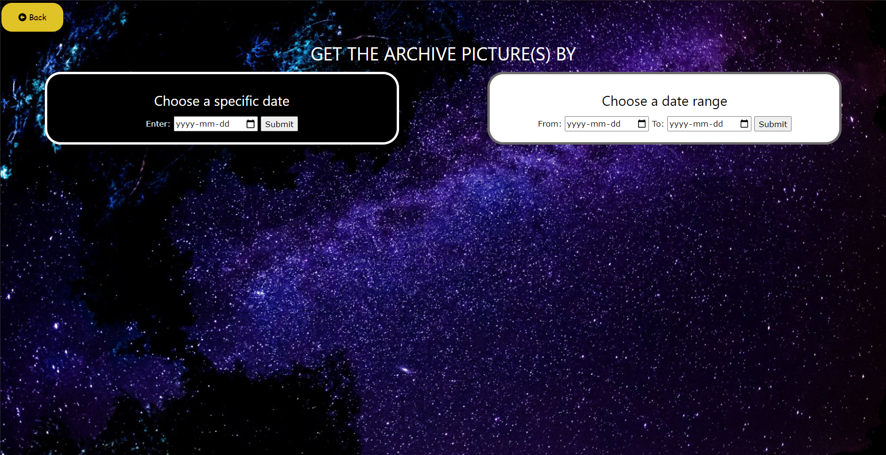
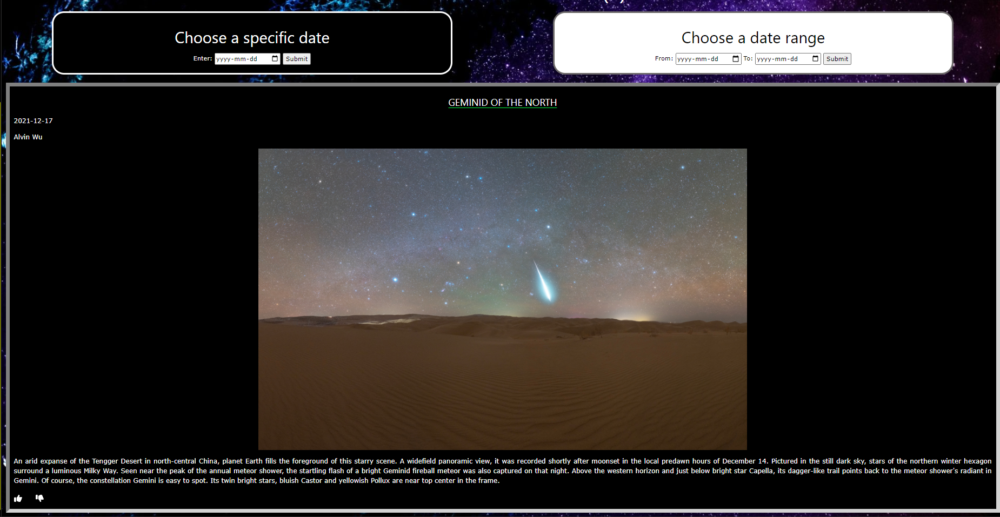
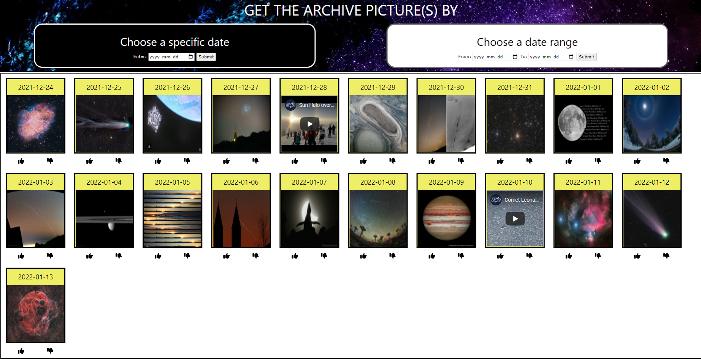

Shopify_JSON

<a href="https://phnam2.github.io/Shopify_JSON/">Link</a> to the web page

<h2>The first page show today picture/video</h2>

<h2>The second page show the search options</h2>

<h2>Result of a specific day search</h2>

<h2>Result of a range day search. You can also click on the pictures for more details</h2>

